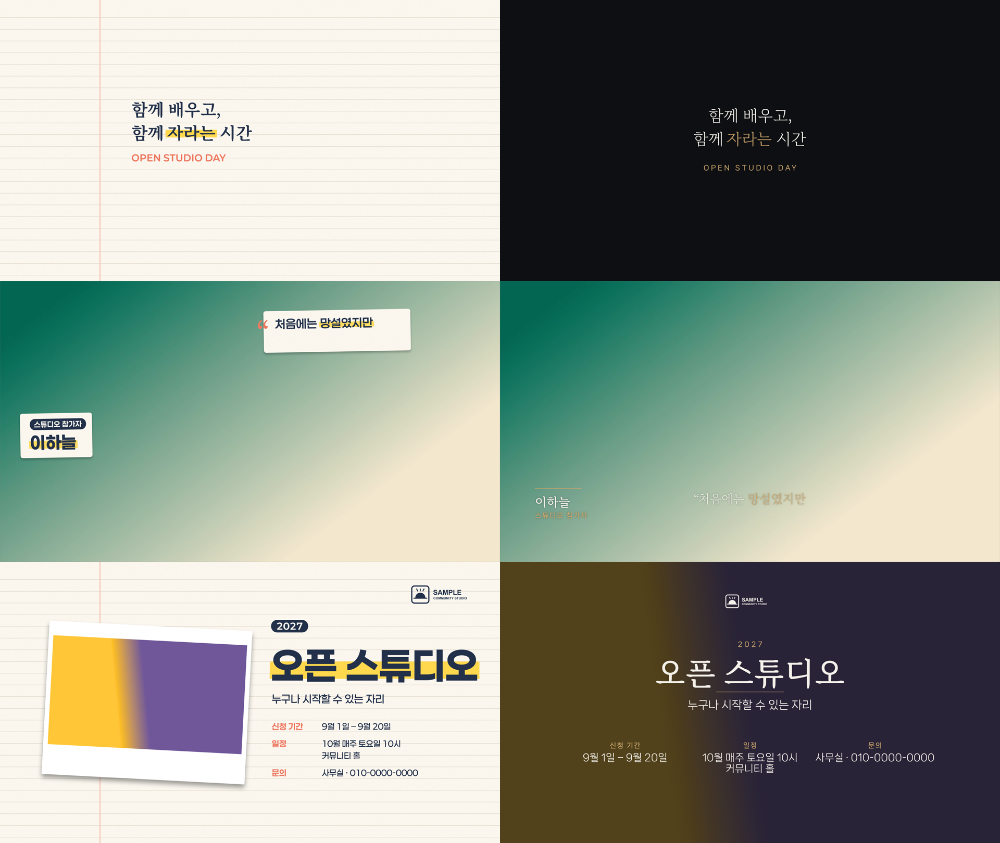

# ae-video-studio

[](https://github.com/Exotica0122/ae-video-studio/actions/workflows/ci.yml)

A Claude Code plugin for making polished, motion-designed videos in **Adobe After Effects**:
from footage, voice recordings and a short brief to a 4K master, with a preview you approve
before every creative or expensive step (story → design & fonts → grade → 15 s test →
key stills → review render → master).

> Status: all eight skills are in place; the flow runs end to end from footage to master.
> The design is in [`docs/design.md`](docs/design.md). Skills were generalised from a first
> real production; no project footage, audio, names or logos are kept in this repo.

<sub>An independent project, not affiliated with or endorsed by Adobe. Adobe and After Effects
are trademarks of Adobe Inc.</sub>

## Demo

<p align="center">
  <a href="docs/media/demo.mp4"></a>
  <br>
  <sub><a href="docs/media/demo.mp4">Watch the full 40 s cut with sound (MP4)</a></sub>
</p>

This cut was built and rendered in After Effects from [`examples/demo/edit.json`](examples/demo/edit.json).
The footage is placeholder gradients made by `make_media.py`. Everything on top of it came from
the plugin: title card, word-timed captions with highlight sweeps, name tag, pull quote,
end card with event details, the music bed with ducking under voice, and the whoosh SFX.

### Same edit, two designs

One edit plan, built with `--design notebook` (left) and `--design cinematic-minimal` (right).
The story, timing and text stay the same; typography, layout, colour and motion change with the design.



## Prerequisites

This plugin drives After Effects through the
[After Effects MCP](https://github.com/Dakkshin/after-effects-mcp) server, so that needs to
be set up first. The plugin uses a `runJsx` command that the upstream server doesn't have, so build
a patched copy with the bundled script instead of installing upstream directly:

```bash
bridge/install.sh     # clones Dakkshin/after-effects-mcp at a pinned commit, patches and builds it
```

Then, in After Effects, copy the bridge's ScriptUI panel into `Scripts/ScriptUI Panels/`,
open **Window > mcp-bridge-auto.jsx** and tick **Auto-run**. The plugin registers the
`after-effects` MCP server itself, so you don't need to add it to Claude Code by hand.

## Install

In Claude Code:

```
/plugin marketplace add Exotica0122/ae-video-studio
/plugin install ae-video-studio@ae-video-studio
```

Then check the requirements below with `aestudio doctor`.

## Requirements

- After Effects 2025+ with the MCP Bridge Auto panel (Auto-run on)
- [after-effects-mcp](https://github.com/Dakkshin/after-effects-mcp) with the `runJsx` command — see [Prerequisites](#prerequisites)
- ffmpeg, Python 3.10+, mlx-whisper (optional, for word-timed captions)

Check all of it at once, with the exact fix for anything missing:

```bash
cd engine && python3 -m aestudio doctor        # add --ping to prove the bridge end to end
```

If the bridge is already built somewhere of your own, point the plugin at it rather than
building a second copy:

```bash
export AESTUDIO_BRIDGE_SRC=~/mcp/after-effects-mcp
```

## Engine quick start

```bash
python3 examples/demo/make_media.py                    # fictional demo media (needs ffmpeg)
cd engine
python3 -m unittest discover -s tests -t . -v          # unit tests (no After Effects needed)
python3 -m aestudio validate ../examples/demo/edit.json --design notebook
# with After Effects + MCP Bridge Auto panel open and a new project:
python3 -m aestudio build ../examples/demo/edit.json --design cinematic-minimal --project ../examples/demo/build/demo.aep
```

Look at footage and pick a design before building:

```bash
python3 -m aestudio log-footage ../examples/demo/media --out /tmp/demo-analysis
python3 -m aestudio design-propose --analysis /tmp/demo-analysis --out /tmp/demo-preview --mood warm
python3 -m aestudio design-preview --dir /tmp/demo-preview
```

See `docs/components.md` for the edit-plan graphics and `skills/ae-build-render/SKILL.md` for the full workflow.

## Working on the plugin

Install from your clone instead of GitHub so your changes load:

```
/plugin marketplace add /path/to/your/ae-video-studio
/plugin install ae-video-studio@ae-video-studio
```

## Layout

```
.claude-plugin/   plugin + dev marketplace manifests
docs/design.md    flow, gates, skills, edit-plan format, lessons learned
skills/           one folder per skill; video-director, studio-doctor, footage-logging,
                  design-system, color-grade, audio-post, ae-build-render, video-qa
engine/aestudio/  media.py ffprobe/ffmpeg helpers, footage.py footage logging, transcribe.py Whisper
                  import, fonts.py installed-font catalogue, designgen.py compose design drafts,
                  styleframe.py render mockup HTML, preview.py serve mockups + record the choice
lib/              shared After Effects primitives + component contracts (in progress)
designs/          saved design recipes (notebook, cinematic-minimal, …); new ones are generated per video
bridge/           runJsx patch for after-effects-mcp + install.sh to build it
examples/         fictional sample assets (e.g. sample-logo-white.png)
```

## License

[MIT](LICENSE)
